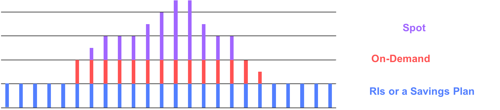
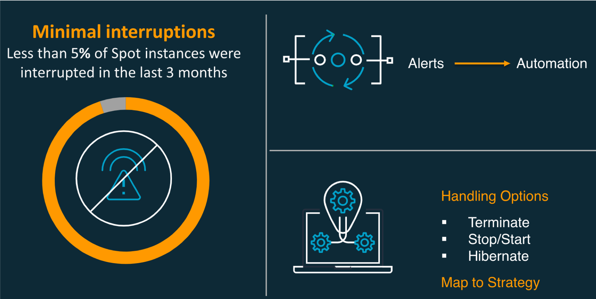
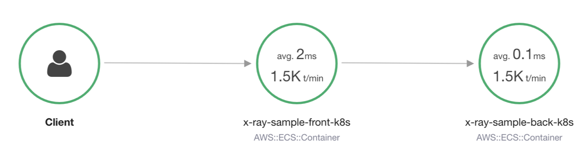
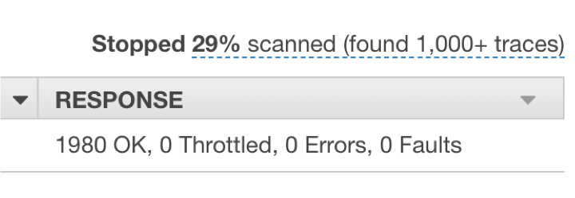
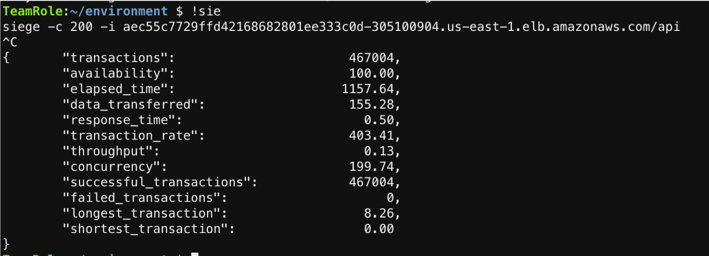

# AWS EKS Spot workshop

## Introduction

This workshop includes a demonstration of how Spot can be adopted on EKS.

1. Application with pods running on both on-demand and spot nodes
1. Gracefully handle spot node interruption
1. Verify performance impact during spot node interruption

**Note**: the content is customized from eksworkshop.com with the focus on Spot in mind.

### Pre-requisites

1. An existing workload on AWS
1. Tech team with foundation knowledge of EKS

### Audience persona

1. CTO / Decision maker
1. Tech lead
1. DevOps lead

## Table of content

1. Why Spot on EKS?
1. Set up AWS environment
1. Create a template EKS cluster
1. Create a Spot nodegroup
1. Set up monitoring tools: CloudWatch Event, CloudWatch Container Insights
1. Simulate Spot interruption event
1. Tracing with X-ray
1. Partner's solutions

## Why Spot on EKS?


* Containers are often stateless, fault-tolerant, and a great fit for Spot Instances
* Deploy containerized workloads and easily manage clusters at any scale at a fraction of the cost with Spot Instances
Given the statelessness of services and elastic scaling, achieving 100% spot on EKS is totally possible

**Quick tips**

1. Use Spot fleet with multiple instance types instead of a specific instance type to increase resource availability
1. Utilize 2-minutes Spot interruption window to gracefully handle instance termination

## Set up AWS environment

Complete this [Start the workshop](https://eksworkshop.com/020_prerequisites/) section

## Create a template EKS cluster

Complete this [Launch using eksctl](https://eksworkshop.com/030_eksctl/) section

## Create a Spot nodegroup

1. Complete this [Add EC2 Workers - Spot](https://eksworkshop.com/beginner/150_spotworkers/workers/) page

**Additional notes**

1. We set the *lifecycle* for the nodes as **Ec2Spot**
1. We are also tainting with **PreferNoSchedule** to prefer pods not be scheduled on Spot Instances
1. Nodes are created with various set of instance types to increase availability

* **Taints** is a property of a node to repel a set of pods. This marks that the node should not accept any pods that do not tolerate the taints. Possible Taint effects are **NoSchedule**, **PreferNoSchedule** or **NoExecute**
* **Tolerations** is a property of a pod to to allow (but do not require) the pods to be scheduled onto nodes with matching taints

### Deploy the AWS Node termination handler



1. Complete this [Helm CLI installation](https://eksworkshop.com/beginner/060_helm/helm_intro/install/) page
1. Complete this [Deploy the AWS Node termination handler](https://eksworkshop.com/beginner/150_spotworkers/deployhandler/) page

Remember to `cd ..` to get back to parent directory

Analyse the frontend deployment.yml, pay attention to *affinity*, *matchExpressions*, and *tolerations*

### Deploy an application on Spot

1. Complete this [Deploy an application on Spot](https://eksworkshop.com/beginner/150_spotworkers/preferspot/) section

**Additional notes**

1. **Affinity and anti-affinity** is a property of pods that attracts them to a set of nodes. This is similar to nodeSelector, but

* Offers more flexible matching rules (vs. exact matches)
* Offers soft/preferences (vs. hard requirement) so pods will always be scheduled

1. **Anti-affinity** (inter-pod affinity)
Offer constraints against other pods (vs. just node) allowing rules to let/prevent pods co-location.

Please do not perform **Cleanup**, we will need these resource for subsequent part of this workshop.

## Set up monitoring tools

### CloudWatch Event

Configure CloudWatch Event rule which listens to all EC2 events

* Service: EC2
* Events: All events
* Target: CloudWatch log group e.g. /ec2Events

### CloudWatch Container Insights

1. Complete the [Preparing to Install CloudWatch Container Insights](https://eksworkshop.com/intermediate/250_cloudwatch_container_insights/cwcinstallprep/) page
1. Complete the [Installing CloudWatch Container Insights](https://eksworkshop.com/intermediate/250_cloudwatch_container_insights/cwcinstall/) page

## Simulate Spot interruption event

Referring to this [page](https://eksworkshop.com/spot/simulateinterrupt/) for description, but the instructions are outdated

1. Login to AWS EC2 Console

* In the left hand menu bar, choose Spot Requests
* Click on Request Spot Instances button
* Launch template: empty (so we can change configuration parameters)
* Search for AMI under Amazon AMIs,  refer to old spot’s AMI (e.g. *amazon-eks-node-1.15-v20200507*)
* VPC: select *eksworkshop*
* Select AZs with valid subnets
* Key pair name: eksworkshop
* Additional configurations:

  * Security groups: select both \*ng-spot\* and \*ClusterSharedNodeSecurityGroup\*
  * IPv4: enabled
  * IAM instance profile: *ng-spot*
  * User data

  ```bash
  #!/bin/bash
  set -o xtrace
  /etc/eks/bootstrap.sh eksworkshop-eksctl --kubelet-extra-args --node-labels=lifecycle=Ec2Spot
  ```

  * Tags:

  |Key|Value|
  |---|---|
  |Name|EKSSpot-SpotFleet-Node
  |`kubernetes.io/cluster/eksworkshop-eksctl`|owned
  |`k8s.io/cluster-autoscaler`/enabled|true
  |Spot|true

* Ensure “Maintain target capacity” is checked. Select **Create**
* Wait for few minutes (about 8-10)

2. Verify that new nodes are added to the cluster ``kubectl get nodes``. Record the new node ID.
1. Follow the ”interruption handler” pod logs

```bash
kubectl get pods -A -o wide
```

Record the termination-handler pod that run on the new spot node. Replace the pod id for *<aws-node-termination-handler-id-*****>* on the command below.

```bash
kubectl --namespace kube-system logs -f <aws-node-termination-handler-id-*****>
```


4. [Verify CloudWatch Container Insights is working](https://eksworkshop.com/intermediate/250_cloudwatch_container_insights/verifycwci/)
1. [Preparing your load test](https://eksworkshop.com/intermediate/250_cloudwatch_container_insights/prepareloadtest/)
1. Get ALB of frontend deployment `kubectl get svc -o wide`1. [Running your load test](https://eksworkshop.com/intermediate/250_cloudwatch_container_insights/runloadtest/) for 5 minutes
1. Reduce the previous Spot Requests down to 0
1. [Verify metrics on CloudWatch dashboards](https://eksworkshop.com/intermediate/250_cloudwatch_container_insights/viewvetrics/)
1. After 5 minutes, stop the load test ``ctrl + c`` and verify siege stats with: ``availability: 100.00``
1. Verify impact to the applications

* Termination handler pod log
* Spot Requests’ history tab: “termination_notified” event and its timestamp
* EC2 instance is shutting down
* Verify CloudWatch insights for terminated spot instance
* Verify pod was evicted and deployed to other nodes
``kubectl get pods -o wide`` (notice the age)

11. Verify EC2 spot events through CloudWatch Events. Run CloudWatch insights query: (replace <i-09e6a1b2cff2*****> with the spot instance ID from Spot Requests)

```bash
fields @timestamp, @message, `detail-type`, detail.state
| sort @timestamp desc
| limit 20
| filter `detail.instance-id` = "<i-09e6a1b2cff2*****>"
```

## Tracing with X-ray

1. Remove previous applications

```bash
cd ~/environment/ecsdemo-frontend
kubectl delete -f kubernetes/service.yaml
kubectl delete -f kubernetes/deployment.yaml

cd ~/environment/ecsdemo-crystal
kubectl delete -f kubernetes/service.yaml
kubectl delete -f kubernetes/deployment.yaml

cd ~/environment/ecsdemo-nodejs
kubectl delete -f kubernetes/service.yaml
kubectl delete -f kubernetes/deployment.yaml
```

2. Going to 100% spot

* Change the ASG for on-demand instances to 0
* Increase Spot Requests capacity to 2

3. Increase the previous Spot Requests up to 1
1. Read this [X-ray overview page](https://eksworkshop.com/intermediate/245_x-ray/) page
1. Manually add **AWSXRayDaemonWriteAccess** to spot nodegroup's IAM role (\*ng-spot*)
1. [Deploy X-ray daemonset](https://eksworkshop.com/intermediate/245_x-ray/x-ray-daemon/)
1. Deploy example microservices

```bash
wget https://eksworkshop.com/intermediate/245_x-ray/sample-front.files/x-ray-sample-front-k8s.yml
wget https://eksworkshop.com/intermediate/245_x-ray/sample-back.files/x-ray-sample-back-k8s.yml
```

* Configure front and back deployment to have the same affinity and tolerations (as the previous *frontend* deployment)
* Deploy the example X-ray applications

```bash
kubectl apply -f x-ray-sample-front-k8s.yml
kubectl apply -f x-ray-sample-back-k8s.yml
```

* Scale both deployment to 10

```bash
kubectl scale deployment x-ray-sample-front-k8s --replicas 10
kubectl scale deployment x-ray-sample-back-k8s --replicas 10
```

* Verify pods are all 4 spot nodes

```bash
kubectl get nodes; kubectl get pods -o wide
```

8. Run load test again on new X-ray applications

* Get service ALB

```bash
kubectl get svc -o wide
```

* Run load test. Replace ALB_URL below

```bash
siege -c 200 -i <ALB_URL>/api 
```

9. Leave load test running for 5 minutes
1. Interrupt spot instances by reduce Spot Requests capacity from 2 to 0
1. Verify X-ray panels




12. Stop siege load test after 5 minutes. Verify siege stats


## Clean up

```bash
kubectl delete -f x-ray-sample-front-k8s.yml
kubectl delete -f x-ray-sample-back-k8s.yml
kubectl delete -f https://raw.githubusercontent.com/kubernetes/dashboard/v2.0.0/aio/deploy/recommended.yaml
```

Remove X-ray and CloudWatch policies (if added manually) from NodeGroups

```bash
eksctl delete cluster --name=eksworkshop-eksctl
```

Go to your Cloud9 Environment, select the environment named **eksworkshop** and pick **delete**

## Partner's solutions

### Spot.io
* Charge based on cost savings
* Has algorithm that predicts an instance (based on types/regions) which would be reclaimed and move pods in advance
* Offload the config operations / monitoring effort
* Right sizing recommendations
* Cloud Analyzer provides recommendations on which components/pods can run on RI/OD/spot
